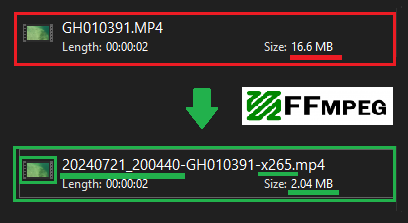
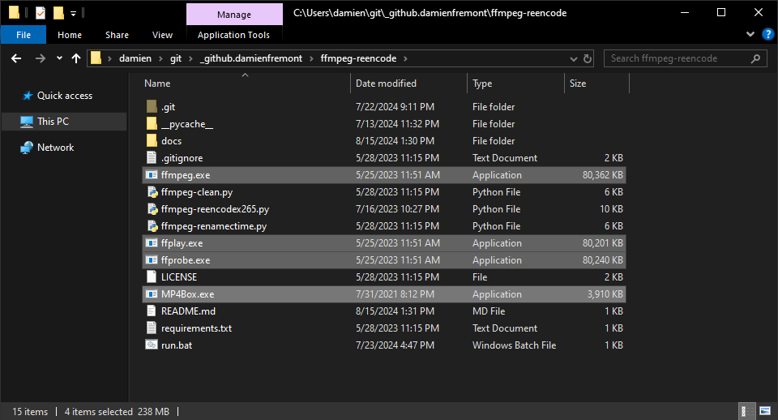
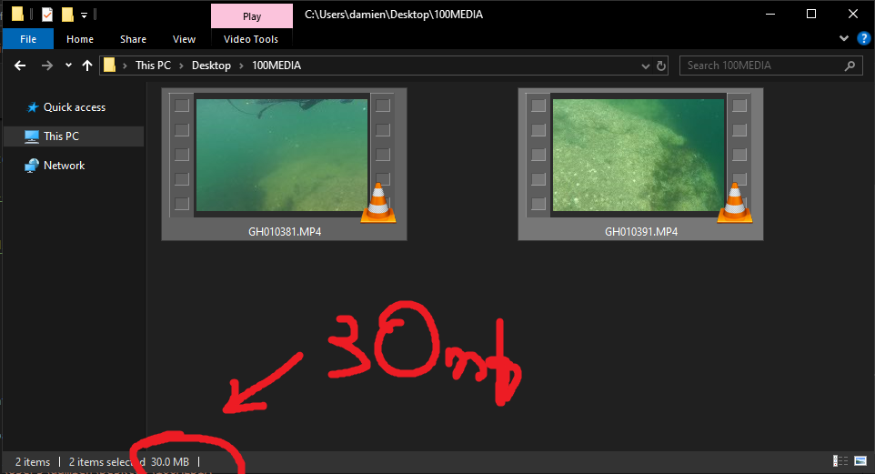
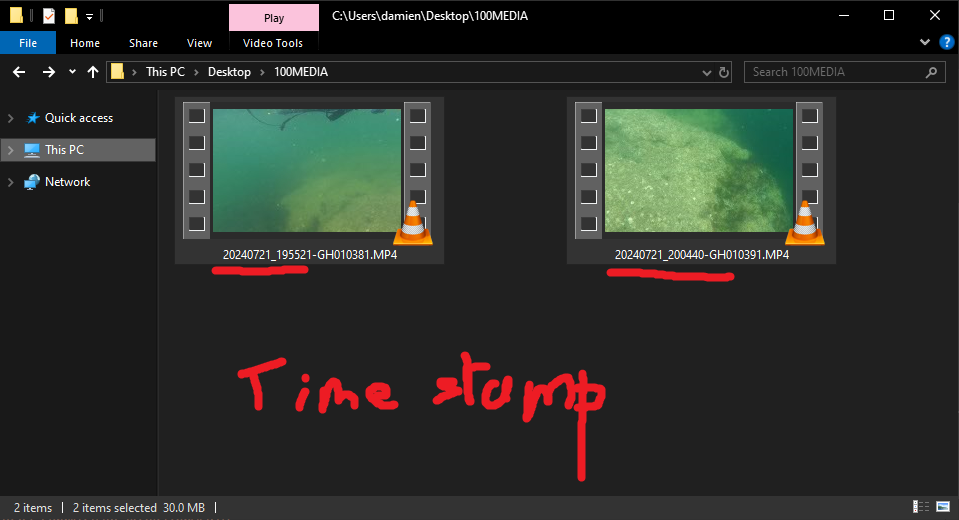
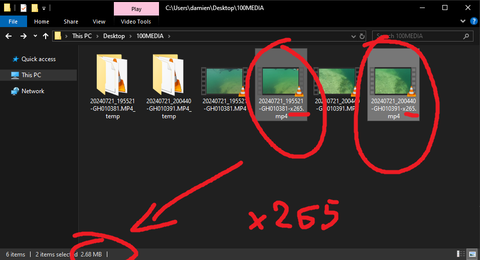

# FFmpeg - Reencode Camera Video Folder (H265, Timestamp, Thumbnail)



Useful for GoPro or DJI Drone videos. 

Reencode videos folder's content to x265, with thumbnails
(tested with ffmpeg "Latest Auto-Build (2022-09-13 12:39)")

Example : 
- Input `DJI_0721.MP4`
- Output `20221017_170300-DJI_0721-x265.mp4` (with thumbnail)

---

## Getting Started

Install Python 3, pip, ffmepg, mp4box.exe

```bash
pip install -r requirements.txt --force-reinstall

wget https://www.gyan.dev/ffmpeg/builds/ffmpeg-git-essentials.7z
# unzip

wget https://gpac.wp.imt.fr/downloads/

```



---

## Usage

```bash
python .\ffmpeg-renamectime.py --dirpath "C:\Users\damien\Desktop\100MEDIA"

python .\ffmpeg-reencodex265.py --dirpath "C:\Users\damien\Desktop\100MEDIA"
```







---

## Resources

- https://ffmpeg.org/
  - https://ffmpeg.org/download.html#build-windows
